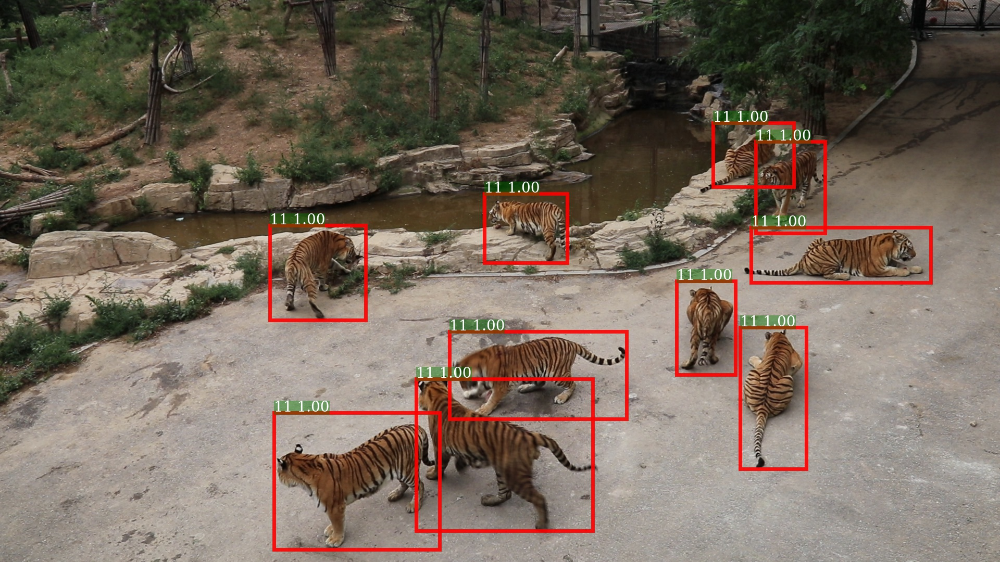

# CVWC2019-Amur-Tiger-Detection

<div align="center">



<p> Example output of <b>Faster_Rcnn-R-50-FPN_1x</b> .</p>

</div>

This code is for the **Tiger Re-ID in the Wild track**(detection part)[CVWC2019](https://cvwc2019.github.io/challenge.html) @ICCV19 Workshop:

**To generate detected tiger pictures for Tiger Re-ID in the Wild**.

## Getting Started
### Clone the repo:

```
git clone https://github.com/LcenArthas/CWCV2019-Amur-Tiger-Detection.git
```
### Dependencies

Tested under python3. Ubantu16.04

- python packages
  - pytorch==0.4.1(Note: V1.0.1 may result in an error)
  - torchvision>=0.2.0
  - cython==0.29.3
  - cffi==1.12.3
  - matplotlib==3.1.1
  - tqdm==4.32.2
  - numpy==1.16.4
  - scipy==1.2.1
  - opencv==4.1.0.25
  - pyyaml==5.1.1
  - packaging==19.0
  - [pycocotools](https://github.com/cocodataset/cocoapi)  — for COCO dataset, also available from pip.
  - tensorboardX  — for logging the losses in Tensorboard
- An NVIDAI GPU and CUDA 8.0 or higher. Some operations only have gpu implementation.

### Compilation

Compile the CUDA code:

```
cd lib 
sh make.sh
```

It will compile all the modules you need, including NMS, ROI_Pooing, ROI_Crop and ROI_Align. (Actually gpu nms is never used ...)

## Train

### Data Prearation

- [Train Dataset](https://pan.baidu.com/s/17GxUlEwojRjNLtLlRbCPqw)

1.Creat a new folder named `/Original_train/` under the `{repo_root}/data/`:

```
cd data
mkdir Original_train
```

2.Put the train dataset(two folder: `atrw_anno_detection_train` & `atrw_detection_train`) in the `{repo_root}/data/Original_train/` folder under the repo.

3.Transform the data style for the model

```
python make_coco_data.py
```

### Pre-trained weight

1.Creat a new folder named `/pretrained_model/` under the `{repo_root}/data/`:

```
cd data
mkdir pretrained_model
```

2.Download the pre-trained weighte and put it(resent50_caffe.pth) into the `{repo_root}/data/pretrained_model/`. 

- [Pre-trained weight](https://pan.baidu.com/s/1pGsK1it1Y7gBVqd9it7OIA)

**And make sure the repo files as the following structure:**
  ```
  {repo_root}
  ├── configs
  ├── demo
  ├── lib
  ├── data
  |   ├── coco
  │   │    ├── anntations 
  │   │    |    └── instances_train2017.json
  │   │    └── images
  │   │         └── train2017
  │   │               ├── 0000.jpg
  │   │               ├── 0002.jpg
  │   │               ├── 0003.jpg
  │   │               ├── 0004.jpg
  │   │               ├── 0005.jpg
  │   │               └── ...
  |   ├── Original_train
  |   |    ├── atrw_ann_detection_train
  |   |    ├── atrw_detection_train
  |   |    └── data
  |   └── pretrained_model
  |        ├── resnet50_caffe.pth
  |        └── resnet101_caffe.pth  
  ├── tools
  └── make_coco_data.py
      
  ```
  
### Inference Now!

## Inference

### Data Preparation

Creat a new folder named `/test/` under the {repo_root}:

```
mkdir test
```

Put the test images in the `{repo_root}/test/` folder under the repo.

 - [Test Dataset](https://pan.baidu.com/s/1zErd1FW-1lofCacsPL3DmA)


### Download Pretrained Model

I use Faster-rcnn-Resnet50-FPN to train my model.

 - [Trained weight](https://pan.baidu.com/s/1q5Wdzcq6aKtM1H_VugCe3w)

Download it and create a new folder under the {repo_root} named `/trained_weight/`

```
mkdir trained_weight
```

Put the trained weight(best_model.pth) into the `{repo_root}/trained_weight/`.

**And make sure the repo files as the following structure:**
  ```
  {repo_root}
  ├── configs
  ├── demo
  ├── lib
  ├── test
  |   ├── 0001.jpg
  │   ├── 0002.jpg
  │   ├── 0003.jpg
  │   ├── 0004.jpg
  │   ├── 0005.jpg
  │   └── ...
  ├── tools
  ├── trained_weight
  │   ├── best_model.pth
  └── make_coco_data.py
      
  ```
  
### Inference Now!

```
cd tools
python infer_simple.py
```

This process will take about 15 minutes, just a moment, please. 

Run this scrip will generate 3 files in the {repo_root/}:

- **det_submission.json** — for the `Tiger Detection track`, you can submit in the Tiger Detection track (0.45988 mAP in the Public Leaderboard).

- **wide_box.json** — for the `Tiger Re-ID in the Wild track`.

- **reid_test(a folder)** — for the `Tiger Re-ID in the Wild track`, it contains images that have been detected and croped.


